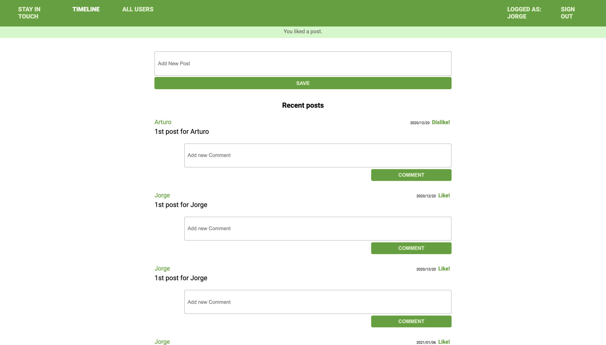

# Scaffold for social media app with Ruby on Rails

>  In this project there is a social media app that was scaffolded by the Microverse team and the purpose was to implement friendships between users, with the functionality to invite friend, see the pending sent and received invitations and lastly accept or decline those invitation.

## Screenshot

## Built With

- Ruby v2.7.0
- Ruby on Rails v5.2.4
- VSCode

## Live Demo

https://fathomless-citadel-51226.herokuapp.com/users/sign_in

### Prerequisites

Ruby: 2.6.3
Rails: 5.2.3
Postgres: >=9.5

### Instructions To Setup Application

1. - Run `git clone git@github.com:Yors-git/ror-social-scaffold.git` to download 
4. - Run `bundle install` to install Ruby Gems
6. - Run `rails db:create` to create a local database
7. - Run `rails db:migrate` to migrate the database
8. - Run `rails s`
8. - Run `http://localhost:3000/` in your browser to start the application

## Author:

### 👨‍💻 Jorge Torres

- Github: [Jorge Torres](https://github.com/Yors-git)
- Linkedin: [Jorge Torres](https://www.linkedin.com/in/jtbribiesca/)
- Twitter: [@Yors_82](https://twitter.com/Yors_82)

## 🤝 Contributing

Contributions, issues and feature requests are welcome!

Feel free to check the [issues page](issues/).

## Show your support

Give a ⭐️ if you like this project!

## Acknowledgments

Microverse Team for the scaffolding

## 📝 License

This is a Microverse project, all rights reserved to Microverse team & Jorge Torres
